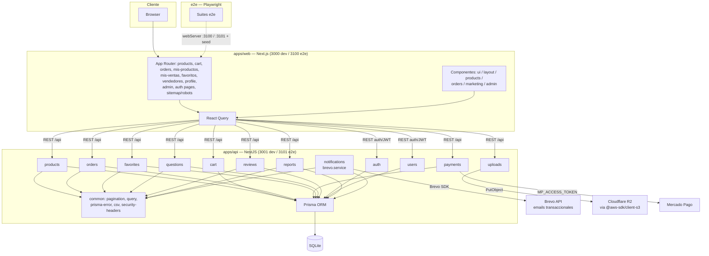

# Arquitectura — Versale

Diagrama del monorepo, verificado contra `main` (2026-08-27).

## Resumen

- **`apps/web`**: Next.js + React Query. Copy en español. Puerto 3000 dev, 3100 e2e.
- **`apps/api`**: NestJS modular (`auth`, `users`, `products`, `cart`, `orders`, `payments`,
  `reviews`, `favorites`, `questions`, `uploads`, `reports`, `notifications`, más `common` y
  `prisma`) sobre Prisma con SQLite. Puerto 3001 dev, 3101 e2e.
- **`e2e`**: Playwright; levanta su propia API y Web (3101/3100) con SQLite dedicado en
  `apps/api/e2e.db` y seed propio.
- **Emails**: el módulo `notifications` integra Brevo para emails transaccionales; `auth`
  lo reutiliza para verificación de email y recuperación de contraseña.
- **Imágenes**: `uploads` escribe en Cloudflare R2 con el cliente S3 (`R2_*` en entorno).
- **Pagos**: `payments` habla con Mercado Pago cuando hay `MP_ACCESS_TOKEN`.

Verificación completa desde la raíz: `npm run test:api`, `npm run test:web`, `npm run e2e`.
