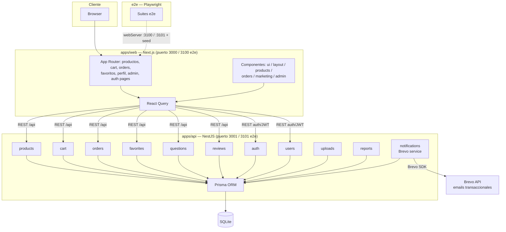

# Arquitectura — Versale

Diagrama básico del monorepo (`main`, actualizado a `f3c1df9`).

## Resumen

- **`apps/web`**: Next.js + React Query. Copy en español. Puerto 3000 dev, 3100 e2e.
- **`apps/api`**: NestJS modular (auth, users, products, cart, orders, reviews, favorites,
  questions, uploads, reports, notifications) sobre Prisma con SQLite. Puerto 3001 dev, 3101 e2e.
- **`e2e`**: Playwright; levanta su propia API y Web (3101/3100) con SQLite dedicado en
  `apps/api/e2e.db` y seed propio.
- **Emails**: módulo `notifications` integra Brevo para emails transaccionales.

Verificación completa desde la raíz: `npm run test:api`, `npm run test:web`, `npm run e2e`.
